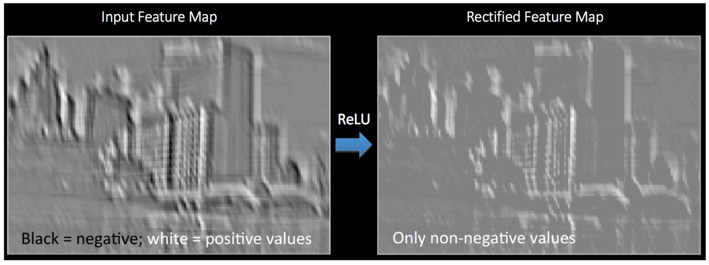

Title: How do Convolutional Neural Networks (CNNs) work?
Date: 2019-05-31 16:00
Category: Deep Learning
Tags: CNN
Slug: cnn

A Convolutional Neural Network (CNN) is an algorithm which can take in an image, assign importance (learnable weights and biases) to various aspects/features/filters in the image and be able to differentiate one from the other.

The architecture of a CNN can be thought to be similar to that of the connectivity pattern of neurons in the human brain. When we see different objects in the world, our brain identifies different features of an object and their importance (individually and all together), then triggers different neurons to be able to identify what it is.

A CNN typically consists of a number of convolutional and subsampling layers followed by fully connected layers. The benefit of CNN for image classification versus ordinary neural networks is a much more manageable number of parameters. The convolutional and subsampling layers help to reduce parameter/feature size while still retaining the most important information from pixels of an image.

**1. Convolution Steps:** Aims to extract features, using small squares of input data.

*Example of a convulated feature map from a 5 x 5 image and the 3 x 3 (filter) matrix:*

Different filter matrices can detect different features from an image (i.e. edges, curves, etc.).

*Example of two different filter matrices (outline red and green) sliding over an image to extract different features from an image:*

**2. RELU (Rectified Linear Unit) Steps:** Replaces all negative pixel values in the convulated feature map with zeros. Values of a feature map can range from -infinity to infinity. Without any bounds, "neurons" don't know when to "fire" or not. RELU helps determine when "neurons" should be activated.

**3. Pooling Steps:** Reduces dimensionality of a feature map.

*Example of a Max Pooling operation:*

**4. Fully Connected Layers:** The output from the convolutional and pooling layers represent high-level features of the input image. The purpose of the Fully Connected layer is to use these features for classifying the input image into various classes (in our case, smile versus no smile) based on the training image dataset.

**5. Training with Backpropagation:** Convolution + Pooling layers act as Feature Extractors from the input image while Fully Connected layer acts as a classifier.

Convolution neural networks can have any number of convolution, pooling, and fully connected layers and nodes.

*Example of a convolution neural network for predicting a boat class:*

The training process consists of first initializing all filters and weights with random values. Then an image is put through the network to calculate its output probabilities for each class, along with the error. Based on the error, we backpropagate through the network to update the weights to minimize errors. This process is repeated for all images in the training dataset, with the goal to minimize a loss function (i.e. accuracy).