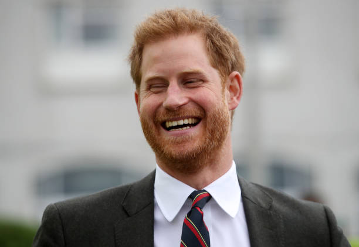

Title: Smile Detection using Convolutional Neural Networks
Date: 2019-05-31 16:00
Category: Deep Learning
Tags: CNN
Slug: dadjokesforsmiles

Smile detection applications are countless from activating a camera shutter automatically, enhancing human-robot interaction, to being incorporated into assistive communication devices for people with disabilities. Using deep learning convolutional neural network algorithms, a smile detection algorithm with an accuracy of 89% was achieved!

 As a project I created [Dad Jokes for Smiles](https://github.com/audreymychan/djsmile), a Flask-powered web application to showcase a smile detection algorithm trained using convolutional neural networks. It takes input from a user's webcam and returns predictions on how much they're smiling! It also provides random dad jokes from *icanhazdadjoke*'s API for fun and because why not.

## Motivation
Motivation for the project came from a previous program I wrote to detect smiles 7 years ago where the algorithm was based on my naive knowledge of what it means for someone to be smiling. For example, I detected the mouth using edge detection then identified smiles based on color pixel changes (red vs white). 

### Problem
Of course this was highly sensitive to noise (i.e. lighting, face orientation, etc). Nowadays with more computing power, we can simply use machine learning to do a better job and remove human bias! Convolutional Neural Networks (CNNs) can find new variables we didn't even know matter and their weights to improve our model. Hypothetically, it might even determine how much ones's crow's feet around the eye impact smile predictions.

## Demo Video
Click the screenshot below to see a demo.

***

## Process

###  Web Scraping
Total of 8,600 images were scraped from Getty Images based on searches for "smile" and "no smile".

   

Refer to `getty_scraper.py` and images folder on my [GitHub](https://github.com/audreymychan/djsmile)

**Tools used:** `requests`, `BeautifulSoup`

###  Image Pre-processing
Images collected were then:
- cropped with a bounding box around faces detected
- converted to grayscale
- resized down to 100 x 100 px
- convert into an array
- normalized

Image dataset was split into a training set and a test set (for model evaluation).

Random transformations and normalization operations (i.e. adjusting for rotation and lighting) were configured on the training set to create more variation for the model to learn.

    

*Image to array example (each pixel ranging from 0 to 255):*

    

Refer to `cnn_model_training.ipynb` and images folder on my [GitHub](https://github.com/audreymychan/djsmile)

**Tools used:** `PIL` - Image, `face_recognition`, `tensorflow.keras` - array_to_img, img_to_array, ImageDataGenerator, to_categorical, `sklearn` - MinMaxScaler, LabelEncoder, train_test_split

###  Training the Model - Convolutional Neural Network (CNN)
A convolutional neural network model was trained using the images.

Refer to `cnn_model_training.ipynb` for layers and weights used in the CNN on my [GitHub](https://github.com/audreymychan/djsmile)

**Tools used:** `tensorflow.keras` - Sequential, Input, Conv2D, MaxPooling2D, Dropout, Dense, Flatten, EarlyStopping

###  Saving the Model
The CNN model and weights learned were saved and can be used to predict smile versus no smile on any new image coming from the app. The model was saved under `my_model.h5` and MinMaxScaler under `scaler.save`.

Refer to `cnn_model_training.ipynb` and models folder on my [GitHub](https://github.com/audreymychan/djsmile)

**Tools used:** `sklearn` - joblib, `tensorflow.keras` - save, load_model

###  Flask App
The app can be generated with the following files:
- `app.py`: main application to run
- `camera.py`: contains Camera object to capture live video feed and `get_frame()` function return image with a bounding box marked around the face and text indicating smile probabilities
- `generate_joke.py`: contains `get_joke()` function to access *icanhazdadjoke*'s API and return a random generated joke
- `smile_recognition.py`: contains `predict_smile()` function which takes in an image frame and returns smile predictions

***
## Future Work
- Publish the app online
    - Make sure it's compatible on all platforms, devices, and camera settings
- Improve the CNN model
    - Some ideas for improvements include:
        - Relabel dataset to ensure images are correctly categorized as smile or no smile
        - Optimizing neural network parameters
        - Increasing dataset
        - Using larger image sizes
        - Using RGB images instead of grayscale
- (nice to have) Improve UX/UI of the application

*Keep smiling... it makes people wonder what you are up to.*

***
# How do Convolutional Neural Networks work?

A Convolutional Neural Network (CNN) is an algorithm which can take in an image, assign importance (learnable weights and biases) to various aspects/features/filters in the image and be able to differentiate one from the other.

The architecture of a CNN can be thought to be similar to that of the connectivity pattern of neurons in the human brain. When we see different objects in the world, our brain identifies different features of an object and their importance (individually and all together), then triggers different neurons to be able to identify what it is.

A CNN typically consists of a number of convolutional and subsampling layers followed by fully connected layers. The benefit of CNN for image classification versus ordinary neural networks is a much more manageable number of parameters. The convolutional and subsampling layers help to reduce parameter/feature size while still retaining the most important information from pixels of an image.

**1. Convolution Steps:** Aims to extract features, using small squares of input data.

*Example of a convulated feature map from a 5 x 5 image and the 3 x 3 (filter) matrix:*

Different filter matrices can detect different features from an image (i.e. edges, curves, etc.).

*Example of two different filter matrices (outline red and green) sliding over an image to extract different features from an image:*

**2. RELU (Rectified Linear Unit) Steps:** Replaces all negative pixel values in the convulated feature map with zeros. Values of a feature map can range from -infinity to infinity. Without any bounds, "neurons" don't know when to "fire" or not. RELU helps determine when "neurons" should be activated.

**3. Pooling Steps:** Reduces dimensionality of a feature map.

*Example of a Max Pooling operation:*

**4. Fully Connected Layers:** The output from the convolutional and pooling layers represent high-level features of the input image. The purpose of the Fully Connected layer is to use these features for classifying the input image into various classes (in our case, smile versus no smile) based on the training image dataset.

**5. Training with Backpropagation:** Convolution + Pooling layers act as Feature Extractors from the input image while Fully Connected layer acts as a classifier.

Convolution neural networks can have any number of convolution, pooling, and fully connected layers and nodes.

*Example of a convolution neural network for predicting a boat class:*

The training process consists of first initializing all filters and weights with random values. Then an image is put through the network to calculate its output probabilities for each class, along with the error. Based on the error, we backpropagate through the network to update the weights to minimize errors. This process is repeated for all images in the training dataset, with the goal to minimize a loss function (i.e. accuracy).